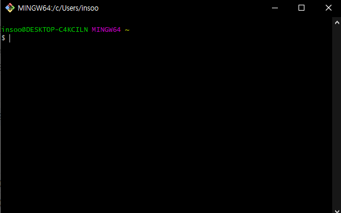
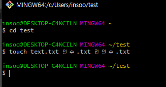

# 1월 25일 화요일

## 1. CLI 기초

### [1] Git 설치하기



1. C: / 사용자(insoo) / 현재 사용자 계정으로 이동한다.
2. 마우스 우클릭후 Git bash Here 클릭한다.
3. Git bash 창에서 ~ 표시 있는 경우 홈폴더를의미한다.

### [2] GCU와 CLI 차이


> 왼쪽은 GUI, 오른쪽은 CLI화면, 화면에 나타나는 모습에서 차이가 있다.
>
> 1. GUI(Graphic User Interface) : 그래픽을 통해 사용자와 컴퓨터가 상호작용한다.
>
> * 일반적으로 사용하는 화면으로 이해하면 될듯?
>
> 2. CLI(Command Line Interface) : 터미널을 통해 사용자와 컴퓨터가 상호작용한다.
>
> * 아나콘다 프롬프트, CMD 창처럼 명령어 입력했던걸로 기억하면 될듯

* 인터페이스(Interface)

  서로 다른 개체끼리 맞닿아 있는 __면__을 뜻한다.사용자와 컴퓨터가 서로 소통하는 접접이라고 이해하자.

* CLI를 사용하는 이유

  1. GUI를 사용하는 경우 : 마우스 우클릭 > 새로 만들기 > 폴더 클릭 > 이름 변경
  2. CLI를 사용하는 경우 : mkdir "폴더이름"

  GUI가 더 쉽지만 단계가 많이 소요된다. 또한 CLI는 GUI로 불가능한, 세부적인 기능을 ㅎ사용할 수도있다.

### [3] 경로

#### (1) 루트, 홈 디렉토리

1. 루트 디렉토리(Root Directory, /)
   * 모든 파일과 폴더를 담고 있는 최상위 폴더(windows의 경우 보통 __C드라이브__)
2.  홈 디렉토리(Home Directory, ~)
   * Tilde(틸드)라고 부르며, 현재 로그인된 사용자의 홈 폴더를 의미한다.
   * 위의 이미지에 보여지는 c:/user/insoo

* 폴더와 디렉토리는 같은 의미로 사용되지만 세부적으로 따져봤을 때, 폴더가 디렉토리보다 __넓은 개념__이라고 할 수 있다.

#### (2) 절대 경로와 상대 경로

1. 절대경로 : 루트 디렉토리부터 목적 지점까지 거치는 모든 경로를 전부 작성한 것

* ex) 윈도우 바탕화면의 경우 c:/Users/insoo/Desktop

2. __상대경로__: 현재 작업하고 있는 디렉토리를 기준으로 계산된 상대적인 위치를 작성한것

* 만약 내가 C:/users에서 작업중이라면 윈도우 바탕화면의 상대경로는 insoo/Desktop가 된다.
* 현재 작업하고 있는 디렉토리가 변경되면 상대경로도 변경된다.
* ./ : 현재 작업하고 있는 폴더를 의미한다.
* ../ : 현재 작업하고 있는 폴더의 __부모(상위)__ 폴더를 의미한다.

### [4] 터미널 명령어

1. touch

* 파일을 생성하는 명령어

* 띄어쓰기로 구분하여 여러 파일을 한번에 생성할 수 있다.
  * ```touch text.txt 인수.txt 전인수.txt``` 입력 할 경우 text, 인수, 전인수 3개의 텍스트 문서 만들어짐



2. mkdir
   * 새폴더 생성하는 명령어 touch와 마찬가지로 띄어쓰기로 여러가지 폴더 한번에 생성할 수 있다.
   * 폴더 이름에 공백 사용하고 싶으면 따옴표로 묶어서 입력한다.
     * ex mkdir "전인수 폴더"(만약 입력 안할경우 전인수, 폴더 총 2개의 새폴더가 만들어진다.)

3. ls
   * 현재 작업중인 디렉토리의 폴더, 파일 목록을 보여주는 명령어
     * -a: all 옵션, 숨김 파일까지 모두 보여준다.
     * -l: long 옵션, 용량, 수정 날짜 등 파일 정보를 자세하게 확인할 수 있다.
4. mv

* 폴더/파일을 다른 폴더 내로 이동 하거나 이름을 변경하는 명령어

* 단, 다른 폴더로 이동할 때에는 작성한 폴더가 있어야 한다. 만약 폴더가 없을 경우 이동이 아닌 이름 변경이 된다.

  * ```bash
    # text.txt를 folder 폴더 안에 넣을 때
    $ mv text.txt folder
    
    # text1.txt의 이름을 text2.txt로 바꿀 때
    $ mv text1.txt text2.txt
    ```

5. cd

* 현재 작업중인 디렉토리를 변경하는 명령어(이동)
  * cd ~ : 홈 디렉토리로 이동
  * cd .. : 부모(상위) 디렉토리로 이동(위로가기)
  * cd . : 바로 전 디렉토리로 이동(뒤로가기)

6. `rm` (없다고 생각하고 입력하지 않기)

- 폴더/파일 지우는 명령어 (GUI와 달리 휴지통으로 이동하지 않고, 바로 삭제한다.)
  - `*(asterisk, wildcard)`를 사용해서 `rm *.txt` 라고 입력하면 txt 파일 전체를 다 지웁니다.
  - `-r` : recursive 옵션. 폴더를 지울 때 사용

```bash
		$ rm test.txt
		$ rm -r folder
```

7. `start, open`

- 폴더/파일을 여는 명령어
- `Windows`에서는 start를, `Mac`에서는 open을 사용할 수 있습니다.

```bash
# Windows
$ start test.txt

# Mac
$ open test.txt
```

8. **유용한 단축키**

   - `위, 아래 방향키` : 과거에 작성했던 명령어 조회

   - `tab` : 폴더/파일 이름 자동 완성

   - `ctrl + a` : 커서가 맨 앞으로 이동

   - `ctrl + e` : 커서가 맨 뒤로 이동

   - `ctrl + w` : 커서가 앞 단어를 삭제

   - `ctrl + l` : 터미널 화면을 깨끗하게 청소 (스크롤 올리면 과거 내역 조회 가능)

   - `ctrl + insert` : 복사

   - `shift + insert` : 붙여넣기


## 2. Markdown 기초

### [1] 마크다운

* 일반 텍스트 기반의 경량 마크업(Markup)언어
* .md 확장자를 가지며, 개발과 관련된 문서는 마크다운 형식으로 작성되어 있는 경우 많다.

#### (1) 장점 및 단점

* 장점
  * 문법이 직관적이며, 관리가 쉽다
  * 지원 가능한 플랫폼과 프로그램이 다양하다.
* 단점
  * 표준이 없어 사용자마다 문법이 다르다.
  * 모든 HTML 마크업 기능을 대신하지 않는다.

#### (2) 마크다운 문법

1. __제목(Headings)__

* __h1 ~ h6__ 에 해당하는 제목을 표현한다.

* #을 사용해서 작성한다.

* 예시

  * ```ㅇmarkdown
    # 제목 1
    ## 제목 2
    ### 제목 3
    #### 제목 4
    ##### 제목 5
    ###### 제목 6
    ```
    

2. __목록(List)__

- 순서가 없는 목록과 순서가 있는 목록을 표현한다.
  - 순서가 없는 목록은 -, *, + 사용한다.
  - 순서가 있는 목록은 1. 2. 3. 과 같이 숫자를 사용한다.
  - 탭(tab), Shift+tab을 사용해서 들여쓰기 내어쓰기를 할 수 있습니다.


3. __강조(Emphasis)__

- 글자의 스타일링을 표현할 수 있다.
  1. 기울이기 : * 글자 * 혹은 _ 글자_로 감싸준다. 
     - 이것은 *기울이기*입니다.
  2. 굵게하기:  ** 글자 ** 혹은 __ 글자__ 로 감싸준다. 
     - 이것은 __굵게하기__입니다.
  3. 취소 : ~~ 글자 ~~ 로 감싸준다. 
     - 이것은 ~~취소선~~입니다.

4. __코드__

   * 한줄 코드인 __인라인__ 코드, 두 줄 이상인 __블록 코드__로 구분한다.

   1. 인라인코드 : 양 옆을 ``으로 감싸준다.
   2. 블록(block)코드 : ``` python 처럼 백틱을 3번 입력하고 코드의 종류를 작성한다.

5.   __링크__

   * 클릭하면 해당 주소로 이동할 수 있는 링크를 표현한다.
   * `[표시할 글자](이동할 주소)` 형태로 작성한다.
     * ex. `[네이버](www.naver.com)`

6. __이미지__

   * 마크다운 문서에 이미지를 삽입할 수 있다.
   * `` 형태로 입력한다.("대체 텍스트"는 이미지를 정상적으로 불러오지 못했을 때 표시되는 문구)

7. __인용(Blockquote)__

   * 주석이나 인용 문구를 표현한다.

   * `>` 를 사용한다. 갯수에 따라 중첩 가능하다.

   * 예시

   * >
     >
     >>
     >>
     >>>

   * 처럼 안으로 중첩이 가능하다.

 8. __표 (Table)__

    * `파이프( | )`와 `하이픈( - )`을 이용해서 행과 열을 구분한다.

    * 테이블 양쪽 끝의 `파이프( | )`는 생략 가능하고, 헤더 셀을 구분할 때는 3개 이상의 하이픈( - )을 사용한다.

    * Typora 사용할 때에는  `ctrl + T` 를  사용해서 표 생성 가능. 

    * 행을 늘릴 때는 `ctrl + enter` 를 누르면 작성가능!!

    * 작성

    * | 인수 | 표 | 만들기 |
      | ------ | ---- | ---- |
      |  예시  |  어려우면  | Ctrl +T로 |
      

9. __수평선__
   * 구분 선을 생성하여 구별 할 수 있다.
   * ` ***`, `---`,`___` 을 3개 이상 연속으로 작성하해서 사용
