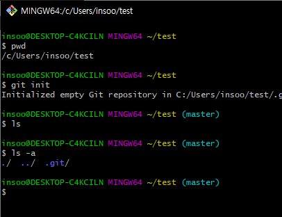
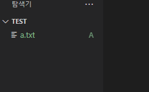
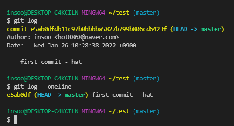
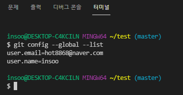
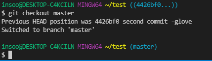
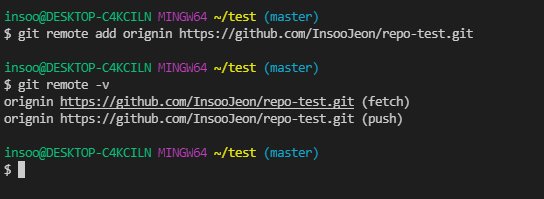
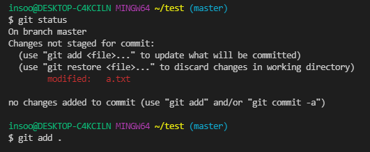
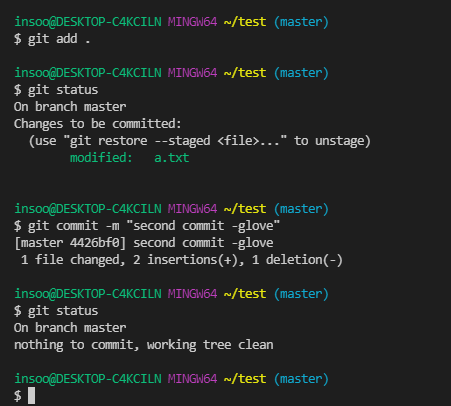
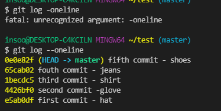

# 깃 등록 프로세스


#  깃 명령어 정리

1. __`git init`__
   * 현재 폴더를 깃이 관리하는 폴더로 만든다(절대 home 폴더에서 사용하면 안된다.)
   * 관리하고 싶은 최상위 폴더에서 최초 1번만 기입한다.
   * git init 입력하면 GUI 환경에서는 숨김폴더로 .git 폴더 보이고 CLI환경에서도 확인가능합니다.
   * 
   
2. __`git status`__
   * 현재 상황을 확인하고 싶을 때 사용하는 명령어
     1. `Untracked` : Git이 관리하지 않는 파일 (한번도 Staging Area에 올라간 적 없는 파일)
     2. Tracked : Git이 관리하는 파일
        1. `Unmodified` : 최신 상태
        2. `Modified` : 수정되었지만 아직 Staging Area에는 반영하지 않은 상태
        3. `Staged` : Staging Area에 올라간 상태
   
3. __`git add` __
   * `git a.txt` : a라는 텍스트 파일을 올리고(등록)싶을 때
     * staging aria에 올린 것 확인할 수 있음(파일 옆에 A로 바뀌어져 있음)
      
   * `git add` (전부다 올리기)
   
4. __`git commit -m "메시지"` __
   * 사진 촬영 후 저장소로 넘긴다.
   
5. __git log  __
   * 저장 된 것들의 버전을 사용하고 싶을 때 사용하는 명령어
   * `git log --oneline` 입력하면 한줄로 확인 가능하다.
   * `git log --graph `: 브랜치와 머지 내역을 그래프로 볼 수 있다.
   
   

> 온라인이 아닌 오프라인에서 작성한다는 사실을 명심

6. __git config 명령어__

   1. `git config --global user.email "이메일"` : 이메일 입력
   2. `git config --global user.name "본인 아이디" `: 아이디 입력
   3. `git config --global --list `: 내가 입력한 내용 확인하는 기능

   

   ​	4 . 기타 git config 명령어 (git config --"오타" 입력하면 보여주는듯?)

   ``` bash
       Config file location
           --global              use global config file
           --system              use system config file
           --local               use repository config file
           --worktree            use per-worktree config file
           -f, --file <file>     use given config file
           --blob <blob-id>      read config from given blob object
   
       Action
           --get                 get value: name [value-pattern]
           --get-all             get all values: key [value-pattern]
           --get-regexp          get values for regexp: name-regex [value-pattern]
           --get-urlmatch        get value specific for the URL: section[.var] URL
           --replace-all         replace all matching variables: name value [value-pattern]
           --add                 add a new variable: name value
           --unset               remove a variable: name [value-pattern]
           --unset-all           remove all matches: name [value-pattern]
           --rename-section      rename section: old-name new-name
           --remove-section      remove a section: name
           -l, --list            list all
           --fixed-value         use string equality when comparing values to 'value-pattern'
           -e, --edit            open an editor
           --get-color           find the color configured: slot [default]
           --get-colorbool       find the color setting: slot [stdout-is-tty]
   
       Type
           -t, --type <>         value is given this type
           --bool                value is "true" or "false"
           --int                 value is decimal number
           --bool-or-int         value is --bool or --int
           --bool-or-str         value is --bool or string
           --path                value is a path (file or directory name)
           --expiry-date         value is an expiry date
   
       Other
           -z, --null            terminate values with NUL byte
           --name-only           show variable names only
           --includes            respect include directives on lookup
           --show-origin         show origin of config (file, standard input, blob, command line)
           --show-scope          show scope of config (worktree, local, global, system, command)
           --default <value>     with --get, use default value when missing entry
   ```

7. __`git checkout `__ 

   1. 돌아가보기 

      1. `git checkout "해쉬값"` : 해당 해쉬값으로 이동하는 기능
      2. `git checkout head~"숫자"` : 숫자 번째 __전__으로 돌아가는 기능 (만약 head~3 입력할 경우 마지막에서 3번째 전으로 돌아간다.)

   2. 다시 빠져나오기

      * `git checkout master ` master로 돌아나오는 기능

      


8.  __브릿지 만들기__
   * `git remote add origin "주소"` :  내 깃허브 주소와 브릿지 연결한 것
   * `git remote -v` : 브릿지 제대로 연결되었는지 확인 할 수 있다.
     
   * `git remote remove "제거할주소"` : 잘못 입력했을 경우 해당 명령어로 삭제할 수 있다.

9.  __등록하기__
   - `git push origin master`

10.   __ignore__


     1.  `touch .gitignore`로 ignore 파일 만든다.
    
     2.  .gitignore는 반드시 git .init한 위치에 같이 두어야한다.
    
     3.  해당 파일에 등록하기 싫은 `파일제목.확장자`를 입력한다.
    
     4.  ignore는 이미 등록된 파일은 지정이 안되기 때문에 add로 올리기 전에 미리 지정해두어야 함
    
     5.  https://gitignore.io/ 에서 사용하는 프로그램 검색하고 해당 내용 복사 붙여넣기 해서 완성
    
         
    
         * 왼쪽에 .gitignore 클릭해서 해당 내용 오른쪽에 작성하여 사용한다.


# git 등록할 때

* `git add` > `git commit` > `git log --oneline (확인)` 순서로 진행되는 것 기억

* 중간중간 status로 상태 확인하고 modified 내용 확인 필요





* 최종적으로 5번 변경했을 때 확인 내용

  
